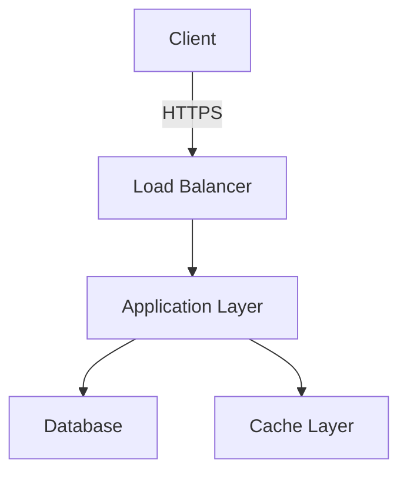

# Design Review Document

## 1. Overview

| Field | Detail |
|-------|--------|
| **Project Name** | |
| **Author** | |
| **Date** | |
| **Review Type** | HLD / LLD |
| **Status** | Draft / Under Review / Approved |

---

## 2. Executive Summary

Provide a brief overview of the design, its purpose, and the business problem it solves.

---

## 3. Architecture Diagram

---

## 4. Components

### 4.1 Component A

- **Purpose:**
- **Technology:**
- **Dependencies:**

### 4.2 Component B

- **Purpose:**
- **Technology:**
- **Dependencies:**

---

## 5. Security Considerations

- [ ] Authentication method defined
- [ ] Authorisation model documented
- [ ] Data encryption at rest and in transit
- [ ] Network segmentation reviewed
- [ ] Compliance requirements addressed

---

## 6. Risks and Mitigations

| Risk | Likelihood | Impact | Mitigation |
|------|-----------|--------|------------|
| | Low / Medium / High | Low / Medium / High | |

---

## 7. Sign-Off

| Role | Name | Date | Approved |
|------|------|------|----------|
| Lead Engineer | | | |
| Architect | | | |
| Project Manager | | | |
