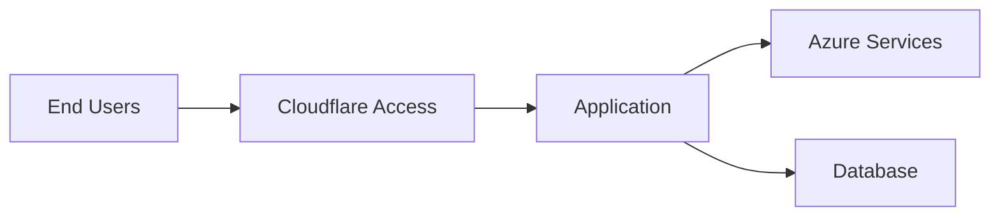

# Project Handover Document

## 1. Project Details

| Field | Detail |
|-------|--------|
| **Project Name** | |
| **Client / Tenant** | |
| **Handover Date** | |
| **Prepared By** | |
| **Handed To** | |

---

## 2. Project Summary

Provide a brief summary of the project scope, what was delivered, and the current state.

---

## 3. Architecture Overview

---

## 4. Environment Details

| Environment | URL / Endpoint | Status |
|-------------|---------------|--------|
| Production | | Active |
| Staging | | Active |
| Development | | Active |

---

## 5. Credentials and Access

| System | Access Method | Owner |
|--------|--------------|-------|
| | SSO / Service Account / API Key | |

> All credentials should be stored in a secure vault. Do not include plaintext secrets in this document.

---

## 6. Known Issues and Technical Debt

| Issue | Severity | Workaround | Planned Fix |
|-------|----------|------------|-------------|
| | Low / Medium / High | | |

---

## 7. Ongoing Maintenance

- **Monitoring:**
- **Backup Schedule:**
- **Patching Cadence:**
- **Escalation Path:**

---

## 8. Key Contacts

| Role | Name | Email |
|------|------|-------|
| Project Lead | | |
| Technical Lead | | |
| Client Contact | | |

---

## 9. Sign-Off

| Role | Name | Date | Signature |
|------|------|------|-----------|
| Outgoing Engineer | | | |
| Incoming Engineer | | | |
| Manager | | | |
